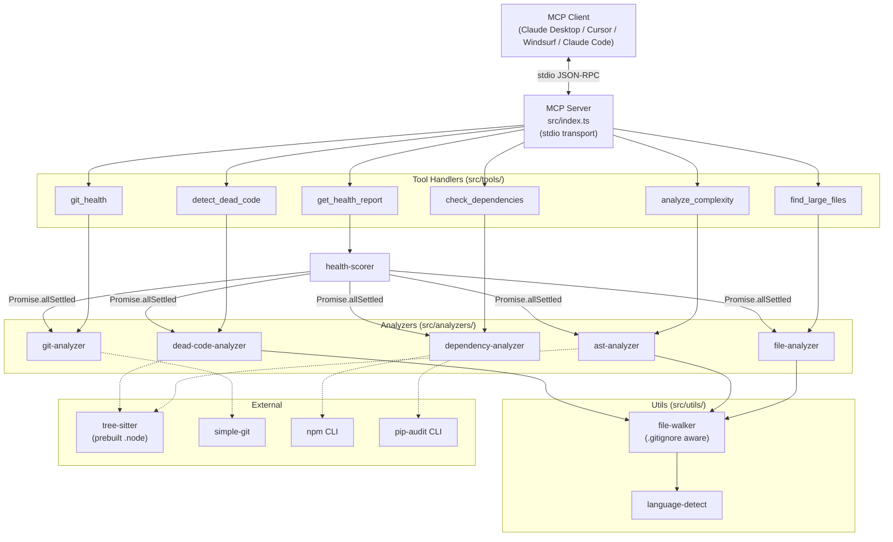

# Sentinel MCP.

A zero-config Model Context Protocol server that gives AI agents instant codebase health analysis. Point it at any local repository and get complexity metrics, dependency audits, dead-code detection, git health scoring, and a prioritized aggregate report. All analysis runs on your machine — there are no databases, no cloud accounts, and no API keys. The only network calls come from `npm audit` and `pip-audit`, which fetch vulnerability data from the npm and PyPI advisory services when `check_dependencies` runs; every other tool is fully offline.

```bash
# Run from a clone (during development)
npx tsx src/index.ts --repo /path/to/your/project

# Once published to npm
npx sentinel-mcp --repo /path/to/your/project
```

---

## Table of Contents

- [Why Sentinel](#why-sentinel)
- [Features](#features)
- [Architecture](#architecture)
- [MCP Tools](#mcp-tools)
- [Installation](#installation)
- [Usage](#usage)
- [CLI Flags](#cli-flags)
- [Scoring Algorithm](#scoring-algorithm)
- [Tech Stack](#tech-stack)
- [Edge Case Handling](#edge-case-handling)
- [Project Layout](#project-layout)
- [Examples](#examples)
- [Tests](#tests)
- [Limitations](#limitations)
- [License](#license)

---

## Why Sentinel

Every engineering team accumulates technical debt, but measuring it usually means standing up SonarQube, CodeClimate, or another heavy tool with databases, cloud accounts, and CI integrations. Sentinel takes a different approach:

- **Zero config** — no databases, no cloud accounts, no API keys
- **Local-first** — every analyzer runs on your machine. The only network calls are from `npm audit` / `pip-audit` (vulnerability data); skip `check_dependencies` for a fully offline run
- **Works with any MCP client** — Claude Desktop, Cursor, Windsurf, Claude Code
- **Multi-language** — TypeScript, TSX, JavaScript, JSX, and Python out of the box
- **On-demand** — no background indexing, runs only when an agent asks
- **Single binary** — one `npx` command, no install scripts, no native build steps for end users (uses prebuilt Tree-sitter binaries)

---

## Features

| Capability | Languages | Driver |
|---|---|---|
| Cyclomatic complexity per function | TS, TSX, JS, JSX, Python | Tree-sitter AST traversal |
| Vulnerability scanning | npm, pip | `npm audit` / `pip-audit` |
| Outdated package detection | npm only | `npm outdated`. pip is intentionally skipped — `pip list --outdated` scans the active interpreter, not the repo's `requirements.txt`, so the count would be misleading. |
| Bus factor + contributor concentration | any git repo | `simple-git` |
| Stale branch detection (30+ days) | any git repo | `git for-each-ref` |
| Single-author file ownership | any git repo | `git log --name-only` aggregation |
| Dead-code (unused export) detection | TS, TSX, JS, JSX, Python | Tree-sitter export/import graph |
| File-size scanner | any text file | line counter + `.gitignore` aware walker |
| Aggregate 0-100 health score | the whole repo | weighted scorer (see below) |

---

## Architecture



The server is a thin MCP shim. Each tool handler delegates to one analyzer (or to the scorer, which fans out to all five). The file walker is the shared entry point for any analyzer that needs to enumerate source files; it honors `.gitignore`, skips known build/vendor directories, and is resilient to permission errors mid-walk. `get_health_report` runs the five analyzers concurrently with `Promise.allSettled`, so a single failing analyzer (e.g., a non-git directory) reduces to a `null` category score in the breakdown rather than crashing the report.

---

## MCP Tools

Sentinel exposes **six** tools to MCP clients.

### `find_large_files`

Walks the repository and reports source files exceeding a configurable line-count threshold. Useful for finding refactor candidates.

**Input:**
```json
{
  "repo_path": "string (optional) — defaults to --repo or process.cwd()",
  "threshold": "number (optional, default: 300) — minimum line count to flag",
  "limit":     "number (optional, default: 20)  — max results to return"
}
```

**Output:**
```json
{
  "large_files": [
    { "file": "src/legacy/monolith.ts", "lines": 1842, "size_bytes": 62400 }
  ],
  "total_files_scanned": 156,
  "files_over_threshold": 8
}
```

### `analyze_complexity`

Parses each TS/TSX/JS/JSX/Python file with Tree-sitter, walks every function node, and computes cyclomatic complexity. Decision points counted: `if`, `for`, `while`, `do`, `switch case`, `catch`, ternary, `&&`/`||`/`??` (JS) and `if`, `elif`, `for`, `while`, `except`, conditional expressions, `boolean_operator` (Python). Nested functions are counted as their own entries; their decisions don't inflate the parent.

**Input:**
```json
{
  "repo_path":   "string (optional)",
  "path_filter": "string (optional) — relative path to a subdirectory or single file",
  "threshold":   "number (optional, default: 10) — minimum complexity for high-complexity list"
}
```

**Output:**
```json
{
  "files_analyzed": 42,
  "total_functions": 186,
  "high_complexity_functions": [
    {
      "file": "src/utils/parser.ts",
      "function_name": "parseExpression",
      "line": 45,
      "complexity": 18,
      "severity": "high"
    }
  ],
  "average_complexity": 4.2,
  "distribution": { "low": 150, "moderate": 28, "high": 6, "critical": 2 }
}
```

Severity bands: `low` ≤ 4, `moderate` 5-10, `high` 11-20, `critical` > 20.

### `check_dependencies`

Detects `package.json` and/or `requirements.txt`, runs the appropriate audit + outdated commands, and normalizes the structured output. Both can be present (`package_manager: "npm+pip"`); both can be absent (graceful `error: "no recognized package manager"`). Missing tooling (no `npm`, no `pip-audit` installed) becomes a `warnings` entry rather than a crash. Each shell-out has a **60-second timeout** so a stuck registry call can't hang the MCP client — timeouts also become a warning.

`pip-audit` is invoked with `--requirement requirements.txt` so it scans the repo, not the active Python environment. `outdated_count` for pip is always `0` with an explanatory `warnings` entry, because pip has no requirements-aware "outdated" mode (`pip list --outdated` would scan the active interpreter).

**Input:**
```json
{ "repo_path": "string (optional)" }
```

**Output:**
```json
{
  "package_manager": "npm",
  "total_dependencies": 45,
  "vulnerabilities": [
    {
      "package": "lodash",
      "severity": "high",
      "current_version": "4.17.15",
      "patched_version": "4.17.21",
      "advisory": "Prototype Pollution"
    }
  ],
  "outdated_count": 12,
  "vulnerability_summary": { "critical": 0, "high": 1, "moderate": 3, "low": 2 }
}
```

### `detect_dead_code`

Builds a cross-file export/import graph and reports exports that no other file in the repo imports. Handles default exports, named exports, namespace imports (`import * as`), re-exports (`export { x } from`, `export * from`), barrel files, dynamic `import("...")`, and Python `__all__`. Entry-point files (`index.*`, `__init__.py`, repo-root files, anything matching `package.json`'s `main`/`module`/`bin`) are excluded from being flagged.

**Input:**
```json
{
  "repo_path":   "string (optional)",
  "path_filter": "string (optional) — relative path to scope analysis"
}
```

**Output:**
```json
{
  "potentially_dead_exports": [
    {
      "file": "src/helpers/format.ts",
      "symbol": "formatLegacyDate",
      "line": 23,
      "type": "function"
    }
  ],
  "total_exports": 89,
  "unused_count": 7,
  "unused_percentage": 7.9
}
```

### `git_health`

Mines git history for ownership and velocity signals. Returns a graceful `error` field for non-git directories or repos with no commit history rather than throwing.

**Input:**
```json
{
  "repo_path": "string (optional)",
  "days":      "number (optional, default: 90) — lookback for contributor analysis"
}
```

**Output:**
```json
{
  "commit_frequency": { "last_30_days": 48, "last_90_days": 142 },
  "bus_factor": 2,
  "contributor_concentration": [
    { "author": "alice", "percentage": 62 },
    { "author": "bob",   "percentage": 25 }
  ],
  "stale_branches": [
    { "name": "feature/old-experiment", "last_commit": "2025-08-12", "days_stale": 120 }
  ],
  "largest_single_author_files": [
    { "file": "src/core/engine.ts", "author": "alice", "ownership_percentage": 95 }
  ]
}
```

Bus factor = the smallest number of contributors whose combined commits cover ≥ 80% of the lookback window. Single-author files require ≥ 3 commits and ≥ 90% ownership by one author.

### `get_health_report`

The flagship tool: runs all five analyzers concurrently, scores each category 0-100, computes a weighted aggregate, assigns a letter grade, and generates the top-5 most actionable recommendations.

**Input:**
```json
{ "repo_path": "string (optional)" }
```

**Output:**
```json
{
  "score": 72,
  "grade": "C+",
  "breakdown": {
    "complexity":   { "score": 65, "weight": 0.30, "summary": "6 high-complexity functions" },
    "dependencies": { "score": 80, "weight": 0.25, "summary": "1 high vulnerability" },
    "git_health":   { "score": 70, "weight": 0.20, "summary": "Bus factor of 2" },
    "dead_code":    { "score": 85, "weight": 0.15, "summary": "7 unused exports" },
    "file_size":    { "score": 60, "weight": 0.10, "summary": "8 files over 300 lines" }
  },
  "top_recommendations": [
    "Refactor parseExpression (complexity: 18) in src/utils/parser.ts",
    "Update lodash to address high-severity vulnerability (Prototype Pollution) — fix in 4.17.21",
    "Split src/legacy/monolith.ts (1842 lines) into smaller modules",
    "Increase contributor diversity — 62% of commits from alice",
    "Remove 7 unused exports to reduce dead code surface"
  ]
}
```

If a category fails (e.g., `git_health` on a non-git directory), its `score` is `null` with an `error` field, and the aggregate is computed over the surviving categories with weights renormalized.

If the repo path itself doesn't exist or isn't a directory, the top-level `score` is `null` and `grade` is `"N/A"`, every category is null, and a top-level `error` field surfaces the reason. This prevents the analyzer's safe-empty shape from being misread as a clean repo:

```json
{
  "score": null,
  "grade": "N/A",
  "breakdown": {
    "complexity":   { "score": null, "weight": 0.30, "summary": "skipped — repository path is invalid", "error": "..." },
    "dependencies": { "score": null, "weight": 0.25, "summary": "skipped — repository path is invalid", "error": "..." },
    "git_health":   { "score": null, "weight": 0.20, "summary": "skipped — repository path is invalid", "error": "..." },
    "dead_code":    { "score": null, "weight": 0.15, "summary": "skipped — repository path is invalid", "error": "..." },
    "file_size":    { "score": null, "weight": 0.10, "summary": "skipped — repository path is invalid", "error": "..." }
  },
  "top_recommendations": [],
  "error": "repository path does not exist or is not a directory: <path>"
}
```

**Type note for consumers:** `score` is `number | null` and `grade` may be `"N/A"`. The top-level `error` is set whenever a precondition failed.

---

## Installation

### From source (current path)

```bash
git clone https://github.com/ManeeshJupalle/sentinel-mcp.git
cd sentinel-mcp
npm install
npm run build       # produces dist/index.js with shebang preserved
```

### From npm (planned)

```bash
npx sentinel-mcp --repo /path/to/your/project
```

---

## Usage

### Claude Desktop

Add to `~/Library/Application Support/Claude/claude_desktop_config.json` (macOS) or `%APPDATA%\Claude\claude_desktop_config.json` (Windows):

```json
{
  "mcpServers": {
    "sentinel": {
      "command": "node",
      "args": [
        "/absolute/path/to/sentinel-mcp/dist/index.js",
        "--repo",
        "/absolute/path/to/your/project"
      ]
    }
  }
}
```

For development (without building) you can use `tsx`:

```json
{
  "mcpServers": {
    "sentinel": {
      "command": "npx",
      "args": [
        "tsx",
        "/absolute/path/to/sentinel-mcp/src/index.ts",
        "--repo",
        "/absolute/path/to/your/project"
      ]
    }
  }
}
```

### Cursor / Windsurf / Claude Code

Any MCP-aware client follows the same pattern: a `command` + `args` invocation that produces a stdio MCP server. The first positional pair is always `--repo <absolute-path>`.

### Programmatic / one-off

You can also drive each analyzer directly without the MCP layer:

```ts
import { analyzeComplexity } from "sentinel-mcp/dist/analyzers/ast-analyzer.js";

const report = await analyzeComplexity("/path/to/repo", { threshold: 10 });
console.log(report.high_complexity_functions);
```

---

## CLI Flags

| Flag | Description |
|------|-------------|
| `--repo <path>` | Default repository path used when a tool call omits `repo_path`. Defaults to `process.cwd()`. |
| `--version`, `-v` | Print the package version (read from `package.json` at runtime) and exit. |

---

## Scoring Algorithm

The aggregate score is a weighted average of five category scores, each normalized to 0-100:

| Category | Weight | Formula |
|---|---|---|
| Complexity | 30% | `100 − (high × 5) − (critical × 10)` |
| Dependencies | 25% | `100 − (critical × 15) − (high × 10) − (moderate × 5) − (low × 2) − min(outdated_count, 10)` |
| Git Health | 20% | `busBase − (stale_branches × 2) + (5 if last_90_days ≥ 30)` where `busBase` is `1 → 40`, `2 → 65`, `3 → 80`, `4+ → 95` |
| Dead Code | 15% | `100 − (unused_percentage × 2)` |
| File Size | 10% | `100 − (files_over_threshold × 3)` |

All category scores are clamped to `[0, 100]`. If a category score is `null` (analyzer failed), it is skipped and remaining weights are renormalized. If **no** category produced a score (e.g. the repo path is invalid), the aggregate `score` is `null` and `grade` is `"N/A"` — distinct from a real `0`/`F`, which would mean the repo scored and scored badly.

**Letter Grade:**

| Grade | Range | Grade | Range | Grade | Range |
|---|---|---|---|---|---|
| A+ | 97-100 | B+ | 87-89 | C+ | 77-79 |
| A  | 93-96  | B  | 83-86 | C  | 73-76 |
| A- | 90-92  | B- | 80-82 | C- | 70-72 |
| D+ | 67-69  | D- | 60-62 | F  | 0-59  |
| D  | 63-66  | | | | |

**Recommendation generation:** categories are sorted worst-first; recommendations are pulled round-robin from each category's candidate list (up to 3 per category) until the top 5 is full. Each recommendation references real file paths, function names, and metrics.

---

## Tech Stack

| Component | Package | Purpose |
|---|---|---|
| MCP framework | `@modelcontextprotocol/sdk` | Server, tool registration, stdio transport |
| AST parsing | `tree-sitter`, `tree-sitter-typescript`, `tree-sitter-javascript`, `tree-sitter-python` | Multi-language AST generation (prebuilt natives, no compile step for users) |
| Git mining | `simple-git` | Programmatic `git log`, `for-each-ref`, etc. |
| Dependency auditing | `npm audit`, `npm outdated`, `pip-audit` (via `child_process`, 60s timeout each) | Vulnerability detection (npm + pip) and outdated detection (npm only) |
| Path filtering | `ignore` | `.gitignore` pattern matching |
| Schema validation | `zod` | MCP tool input schemas |
| Runtime | Node.js ≥ 18, TypeScript 5.7 | ESM, `Node16` module resolution |

---

## Edge Case Handling

Every analyzer is designed to **return data, not throw**. Each one handles:

- **Non-existent / non-directory repo path** — `get_health_report` validates the path up front and short-circuits to `score: null`, `grade: "N/A"`, and a top-level `error`. Individual tools degrade more permissively (`walkRepo` swallows the failed `stat` and returns `[]`), but the orchestrator catches the case before the safe-empty shape can be misread as a clean repo.
- **Relative repo paths** — `walkRepo` normalizes the root with `resolve()` so import-graph comparisons against absolute paths work regardless of the caller's cwd.
- **Empty directories** — every analyzer returns zero counts and empty arrays.
- **Permission denied mid-walk** — `walkRepo` skips unreadable directories/files and continues.
- **Non-git directories** — `git_health` returns a graceful `error: "not a git repository"` with all-zero metrics; the scorer treats this as a `null` category score.
- **No package manager** — `check_dependencies` returns `package_manager: "none"` with a descriptive `error`.
- **Audit tooling not installed or hung** — `npm`/`pip-audit` failures become `warnings` entries, and each shell-out has a **60-second timeout** so a stuck network/registry call can't block the MCP client. Timeouts also surface as warnings; the rest of the report still works.
- **`path_filter` that escapes the repo** — refused at `walkRepo` (returns `[]`) rather than walking the wider filesystem.
- **Binary files** — detected via null-byte sniff and skipped.
- **Parse errors** — caught per file; the file is skipped, the rest of the analysis continues.

In addition, every analyzer's public entry point is wrapped in a top-level try/catch that logs to stderr and returns a safe-empty result if anything unexpected goes wrong (defense in depth — these wrappers should never fire under normal use).

---

## Project Layout

```
sentinel-mcp/
├── src/
│   ├── index.ts                    # MCP server entry, tool registration, --version, --repo
│   ├── tools/                      # One handler per MCP tool — thin wrappers around analyzers
│   │   ├── analyze-complexity.ts
│   │   ├── check-dependencies.ts
│   │   ├── detect-dead-code.ts
│   │   ├── find-large-files.ts
│   │   ├── get-health-report.ts
│   │   └── git-health.ts
│   ├── analyzers/                  # Core analysis engines
│   │   ├── ast-analyzer.ts         # Tree-sitter parsing + cyclomatic complexity
│   │   ├── dead-code-analyzer.ts   # Export/import graph + entry-point exclusions
│   │   ├── dependency-analyzer.ts  # npm/pip audit wrappers, normalized output
│   │   ├── file-analyzer.ts        # File-size scanner
│   │   └── git-analyzer.ts         # Git history mining via simple-git
│   ├── scoring/
│   │   └── health-scorer.ts        # Weighted scorer + letter grade + recommendations
│   └── utils/
│       ├── file-walker.ts          # Recursive walker, .gitignore aware
│       └── language-detect.ts      # Extension → Tree-sitter grammar map
├── tests/                          # Fixture tests (node:test via tsx)
│   ├── dead-code.test.ts
│   ├── file-walker.test.ts
│   ├── health-scorer.test.ts
│   └── repo-path.test.ts
├── examples/                       # Runnable Path 1 (programmatic) recipes
│   ├── ci-check.ts                 # CI quality gate (exit non-zero below threshold)
│   └── report.ts                   # Pretty-print full health report
├── dist/                           # Built output (gitignored)
├── package.json
├── tsconfig.json
└── README.md
```

---

## Examples

For programmatic use without going through MCP, see [`examples/`](examples/):

- **[`ci-check.ts`](examples/ci-check.ts)** — drop into a GitHub Actions step, a pre-commit hook, or any pipeline to fail the build when the aggregate score falls below a threshold:
  ```bash
  npx tsx examples/ci-check.ts /path/to/repo 70
  ```
- **[`report.ts`](examples/report.ts)** — pretty-print the full breakdown and recommendations for any repo:
  ```bash
  npx tsx examples/report.ts /path/to/repo
  ```

Both scripts use the **programmatic import path** (Path 1) — they call `handleGetHealthReport()` directly with no MCP server, no stdio, no JSON-RPC. Copy-paste either one into your own project, swap the relative `../src/` import for `sentinel-mcp/dist/...`, and you have a working integration in ~20 lines.

The other paths (MCP stdio JSON-RPC, MCP Inspector) are useful if you're driving Sentinel from a non-Node language or want interactive exploration — but for CI scripts, dashboards, and most automation, the programmatic import is the simpler, faster choice.

---

## Tests

```bash
npm test
```

The suite uses Node's built-in `node:test` runner driven by `tsx`, so there's no separate framework to install. 20 tests across four files, covering the regressions the project's own audits caught:

**File walker**
- `countLines` boundary cases (empty file, trailing newline, no trailing newline, single newline)
- `walkRepo` behavior when `path_filter` escapes the repo root or the directory doesn't exist

**Dead-code**
- Default exports (`export default function Name()`, `export default class Name`) must match `default` imports
- Python `from . import foo` and `from .pkg import foo` correctly resolve to the submodule
- Genuinely unused exports are still flagged

**Health scorer**
- Letter-grade boundaries
- Aggregate score renormalization when one analyzer fails (e.g. non-git directory)
- All-analyzers-failed case produces `score: null` and `grade: "N/A"` (not `0`/`F`)
- Outdated packages drag the dependency category score even when no vulnerabilities exist

**Repo path**
- `walkRepo` with a relative root produces absolute paths
- `analyzeDeadCode(".")` matches `analyzeDeadCode(resolve("."))`
- `handleGetHealthReport` on a missing path returns `null`/`N/A` plus a top-level error (no false A+)
- `handleGetHealthReport` on a valid path returns a numeric score

---

## Limitations

- **Python dead-code detection is best-effort.** Without `__all__`, every top-level public name is treated as exported. Absolute Python imports cannot be resolved without project config; only relative imports are followed.
- **`pip-audit` doesn't classify severity.** All pip vulnerabilities bucket as `moderate` until pip-audit emits a CVSS field.
- **No symlink following.** The walker does not follow symlinks (intentional, to avoid cycles in monorepos).
- **No JSDoc/TSDoc parsing.** Functions are identified by AST shape, not by `@public`/`@internal` annotations.
- **Single-file path filter.** `path_filter` accepts a directory or a single file; glob patterns aren't supported yet.

---

## License

MIT
